# Pricehawk 🦅

## **The Enterprise-Grade Pricing Error Detection Platform**

> **Catch retail pricing glitches before they go viral. Validate with AI. Profit instantly.**

[](LICENSE)


---

## 📉 The Opportunity

In the complex world of algorithmic pricing, retailers make mistakes every single day. Decimal errors, coupon stacking glitches, and currency conversion mishaps create instant arbitrage opportunities.

**The problem?** By the time you see a deal on social media, it's already dead.
**The solution?** Pricehawk.

| Category        | Typical Price | Glitch Price | Potential Profit |
| --------------- | ------------- | ------------ | ---------------- |
| 📺 **OLED TVs** | $2,499        | **$249.99**  | `$2,250`         |
| 💻 **Laptops**  | $1,200        | **$120.00**  | `$1,080`         |
| 🎧 **Audio**    | $350          | **$35.00**   | `$315`           |
| 🏠 **Home**     | $600          | **$60.00**   | `$540`           |

> _Pricehawk monitors 100+ retailers 24/7, detecting anomalies in seconds and delivering them to you before the public finds out._

---

## ⚡ How It Works

Pricehawk combines distributed web scraping with Generative AI to filter out "fake" sales and identify **true pricing errors**.

```mermaid
graph LR
    subgraph Detection ["👁️ Detection Layer"]
        A[AI Scraping Agent] -->|Tool Calls| B(Firecrawl / Jina / Tavily)
        B -->|Structured Data| C{Anomaly?}
    end

    subgraph Validation ["🧠 AI Validation Layer"]
        C -->|Yes| D[Context Assembler]
        D -->|History + Competitors| E[15 FREE OpenRouter Models]
        E -->|Weighted Round-Robin| F{Confidence >80%?}
    end

    subgraph Delivery ["🚀 Delivery Layer"]
        F -->|Yes| G[Notification Router]
        G -->|Instant| H[Discord / SMS]
        G -->|Digest| I[Email / Twitter]
    end

    style Detection fill:#e1f5fe,stroke:#01579b
    style Validation fill:#f3e5f5,stroke:#4a148c
    style Delivery fill:#e8f5e9,stroke:#1b5e20
```



---

## 🏗️ Technical Architecture

Built for speed, reliability, and scale. Pricehawk operates on an event-driven architecture designed to handle thousands of concurrent price checks.

### Core Stack

- **⚡ Framework**: [Next.js 14](https://nextjs.org) (App Router)
- **🗄️ Database**: [PostgreSQL](https://postgresql.org) + [Prisma](https://prisma.io)
- **📨 Event Bus**: [Redis](https://redis.io) Streams + [BullMQ](https://bullmq.io)
- **🧠 AI Engine**: 15 FREE [OpenRouter](https://openrouter.ai) models with weighted round-robin
- **🕷️ Scraping**: AI Agent with [Firecrawl](https://firecrawl.dev) + [Tavily](https://tavily.com) + [Jina.ai](https://jina.ai)
- **🐳 DevOps**: Docker & Railway

### AI-Powered Intelligence (New in v0.3)

Pricehawk now uses an **agentic AI system** with tool/function calling for intelligent scraping:

| Model Tier | Models | Capabilities |
|------------|--------|--------------|
| **High** | Gemini 2.5 Flash, Gemini 2.0 Flash, Llama 4 Maverick, Qwen 3 235B, DeepSeek V3 | Full tool calling, agentic workflows |
| **Mid** | Llama 4 Scout, Mistral Small 3.1, Llama 3.3 70B, Nemotron 70B, GLM-4 9B | Reliable tool support |
| **Base** | Qwen 2.5 72B, Devstral 2512, Phi-4, + paid fallbacks | Fast fallback options |

**Key Features:**
- **Weighted Round-Robin**: Dynamically selects models based on quality and performance
- **Tool Calling**: AI orchestrates Firecrawl, Tavily, and Jina.ai automatically
- **Circuit Breaker**: Auto-disables failing models, recovers after 5 minutes
- **$0 Cost**: All primary models are FREE via OpenRouter

### Capabilities

- **AI Scraping Agent**: Intelligent tool selection for optimal data extraction
- **Category-Specific Thresholds**: Temporal weighting for anomaly detection
- **Affiliate Monetization**: Automatically injects affiliate tags (Amazon, etc.) into shared links
- **Deal Lifecycle**: Auto-expires deals when prices return to normal
- **Multi-Channel**: Delivers to Discord, Telegram, Twitter/X, and SMS simultaneously

---

## 🚀 Getting Started

Deploying Pricehawk is simple with our Docker compliance.

### 1. Requirements

- Docker & Docker Compose
- API Keys (OpenRouter, Twitter, Telegram, etc.)

### 2. Run with One Command

```bash
# Clone the repository
git clone https://github.com/clduab11/pricehawk.git

# Start the full stack (App + Workers + DB + Redis)
docker compose up --build -d
```

### 3. Access the Dashboard

Visit `http://localhost:3000` to access the admin console and view live pricing feeds.

---

## 💰 Business Model

Pricehawk is designed as a SaaS platform with clear monetization channels:

1. **Subscriptions**: Tiered access (Starter, Pro, Elite) for faster alerts.
2. **Affiliate Revenue**: Automatic tag injection on all shared deal links.
3. **API Access**: Enterprise data stream for high-volume resellers.


---

## 📋 Recent Updates (January 2026)

### v0.3.0 - AI-Powered Scraping Engine
- **15 FREE OpenRouter Models**: Weighted round-robin selection across Gemini, Llama, DeepSeek, Mistral, Qwen
- **Tool Calling Support**: AI agent orchestrates Firecrawl, Tavily, and Jina.ai
- **Circuit Breaker Pattern**: Automatic failover with 5-minute recovery
- **Performance Tracking**: Dynamic weight adjustment based on success rates

### v0.2.5 - PRD Development Analysis
- Comprehensive repository analysis for production readiness
- Identified 8 key development areas with priorities (P0-P3)
- Technical debt assessment and remediation strategies

### v0.2.4 - Category Thresholds & Temporal Weighting
- Category-specific anomaly detection thresholds
- Temporal weighting for time-of-day analysis
- Improved false positive filtering

---

## 🗺️ Roadmap

- [x] **Phase 1: Foundation** - Scrapers, DB, Basic Auth
- [x] **Phase 2: Intelligence** - AI Validation, Redis Pipeline
- [x] **Phase 3: Expansion** - Twitter, Telegram, & Affiliate Integration
- [x] **Phase 3.5: AI Engine** - Weighted Round-Robin, Tool Calling, Agentic Scraping
- [ ] **Phase 4: Mobile** - React Native App & Push Notifications
- [ ] **Phase 5: Global** - International Retailer Support

---

## 🤝 Contributing

We welcome contributions! Please see [CONTRIBUTING.md](CONTRIBUTING.md) for details.

### License

Pricehawk is dual-licensed:

- **ELv2**: Free for personal/non-commercial use.
- **Commercial**: Required for business use or resale.

---

<div align="center">
  <sub>Built with 🦅 by Parallax Analytics</sub>
</div>
